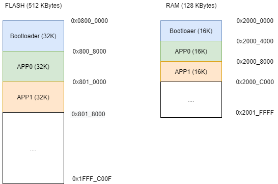
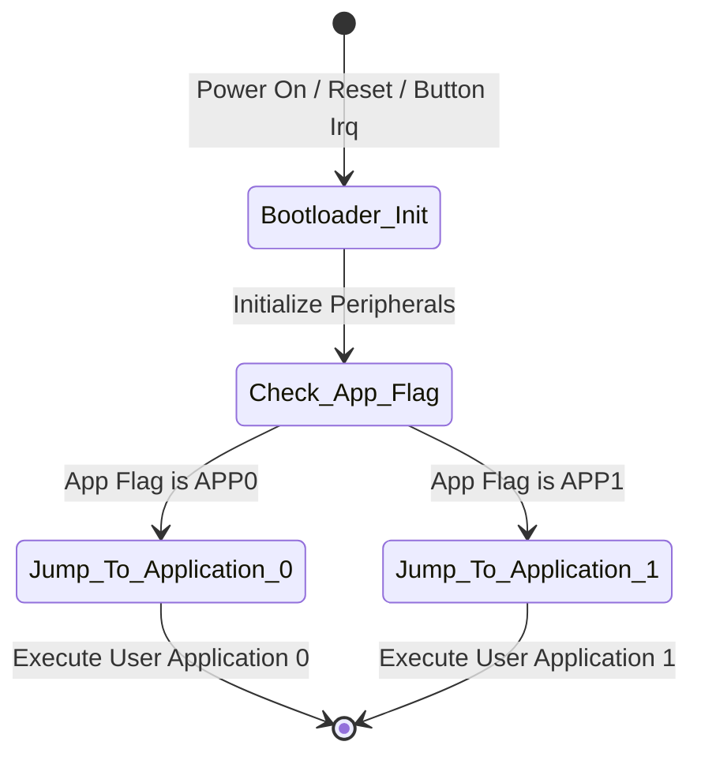

# Bootloader  

Bootloader is a small programm that runs before the main application on a microcontroller. Its main purpose is to manage the process of updating or loading new firmware to the device without needing external programming tools. The bootloader could receive the new application through communication interfaces like UART, CAN, SPI, WIFI, etc and store it in the microcontroller's flash memory. After that, the bootloader transfers control to the application.    

## Version 1.0.0

It is an initial approach to the bootloader where the goal is to jump between APP0 and APP1 when User button is press, so in this case the bootloader doesn't manage any remote upgrade. This version contains the tree application stored in memory.

### Memories split

The memory's assignation is the same for the three application (32 KBytes in FLASH and 16 KBytes in RAM). The split is visible in the next figure.

 

### Execution states

¡